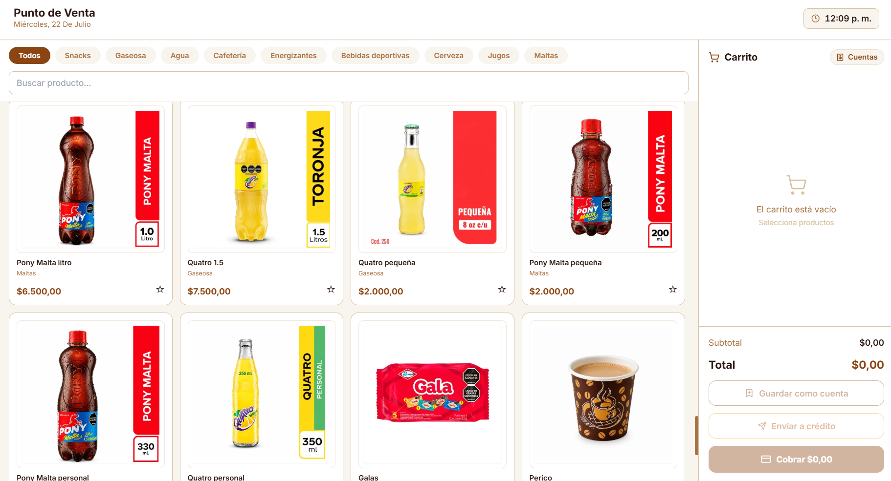
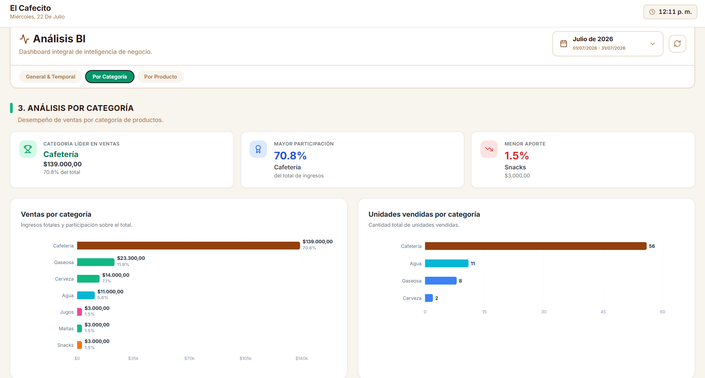
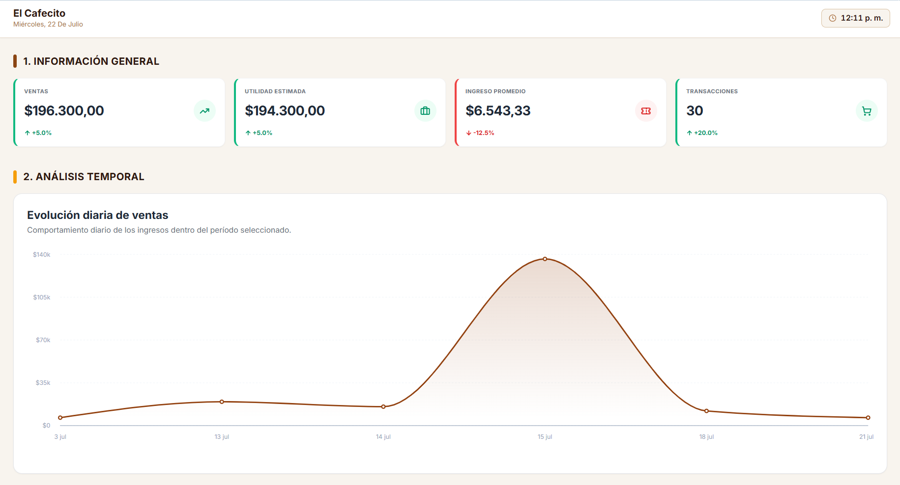
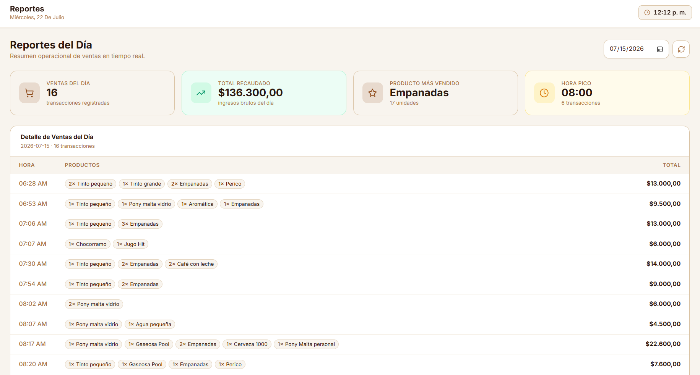

# El Cafecito - Sistema POS (Punto de Venta) ☕

Un sistema integral de Punto de Venta (POS) diseñado específicamente para la gestión de cafeterías, controlando productos, ventas, inventario y métricas en tiempo real.

## 🚀 Características Principales

* **Panel de Ventas (POS):** Interfaz ágil para la toma de pedidos, gestión de productos y procesamiento de pagos.
* **Gestión de Inventario:** Control detallado de productos, variantes y stock disponible.
* **Métricas y Reportes:** Visualización de ventas, productos más vendidos y rendimientos generales para facilitar la toma de decisiones.
* **Sistema de Usuarios:** (Agregar detalles si maneja roles como Administrador/Cajero).

## 🛠️ Tecnologías Utilizadas

### Frontend
* **React (Vite)**: Construcción de una interfaz de usuario rápida y reactiva.
* **Tailwind CSS**: Estilos modernos y completamente responsivos.
* **Recharts**: Visualización de gráficos y métricas de ventas.
* **Lucide React**: Sistema de iconos.

### Backend & Base de Datos
* **FastAPI (Python)**: API robusta y veloz para la gestión de la lógica de negocio.
* **Supabase**: Base de datos PostgreSQL y gestión de autenticación.

## 📸 Capturas de Pantalla

El sistema se encuentra actualmente en funcionamiento con todas sus características principales operativas. 

> 🔮 **Roadmap (Futuro del Proyecto):** Más adelante se integrará **Inteligencia Artificial (IA)** y **automatizaciones** para predecir ventas, sugerir promociones, optimizar el inventario de manera automática y generar reportes inteligentes basados en el comportamiento del negocio.

### 🛒 Punto de Venta (POS)


### 📊 Análisis de Inteligencia de Negocio (BI)


### 📈 Información General y Evolución de Ventas


### 📋 Reportes del Día y Transacciones


## ⚙️ Instalación y Configuración Local

Si deseas ejecutar este proyecto de forma local, sigue estos pasos:

### Prerrequisitos
* Node.js (v18 o superior)
* Python (3.9 o superior)
* Cuenta en Supabase

### 1. Clonar el repositorio
```bash
git clone https://github.com/tu-usuario/el-cafecito-pos.git
cd el-cafecito-pos
```

### 2. Configurar el Frontend
```bash
cd frontend
npm install
# Crea un archivo .env basado en .env.example (si aplica) con tus variables de Supabase
npm run dev
```

### 3. Configurar el Backend
```bash
cd ../backend
python -m venv venv
# Activar entorno virtual
# En Windows:
venv\Scripts\activate
# En Mac/Linux:
source venv/bin/activate

pip install -r requirements.txt
# Configurar variables de entorno (.env) para Supabase y FastAPI
uvicorn main:app --reload
```

## 🤝 Contribución

Este es un proyecto de portafolio personal, pero si deseas hacer sugerencias o mejoras, ¡eres bienvenido a hacer un fork y crear un Pull Request!

## 📝 Licencia

Este proyecto está bajo la Licencia MIT.
